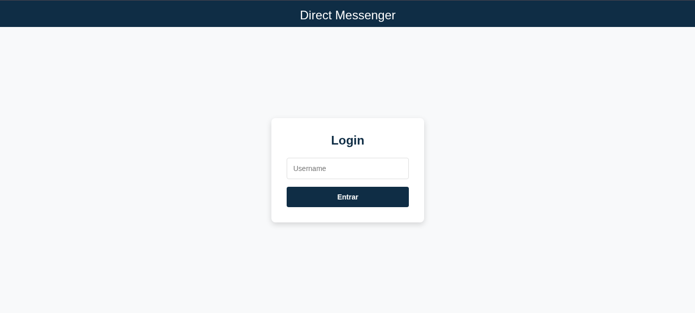
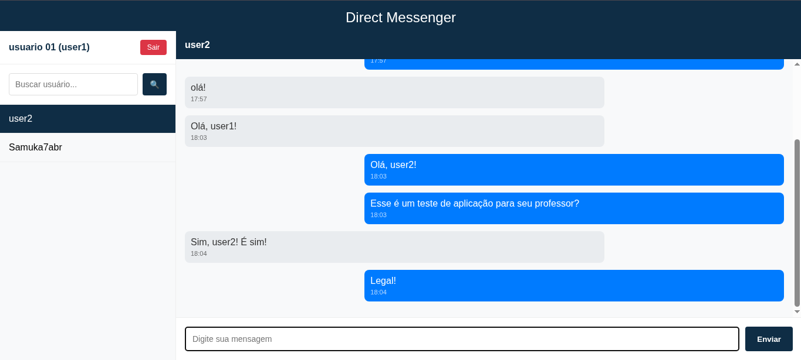

# Trabalho Final – Banco de Dados 2025.1

## Membros do Grupo

| Nome                         | RA         |
|------------------------------|------------|
| Samuel Lima Ewald Abrão      | 24101216   |
| Kayke Queiroz dos Santos     | 24101284   |
| Marcelo da Silva Mello       | 2211257    |
| João Genaro                  | 24101088   |

## Descrição do Projeto

Componente de mensageria da rede social **IDP-Connections**, que permite troca de mensagens privadas entre usuários da plataforma.

## Stack Tecnológica


## Passos para Iniciar o Projeto

### 1. Clone o Repositório

Abra seu terminal ou prompt de comando e execute:

```bash
git clone https://github.com/samuka7abr/IDP-BD-2025.1.git
cd IDP-BD-2025.1/IDP-Mensager
```

---

### 2. Configure Variáveis de Ambiente

O projeto utiliza variáveis de ambiente para suas configurações. Copie o arquivo `.env.example`:

```bash
cp .env.example .env
```

Abra o arquivo `.env` copiado em seu editor de texto e ajuste as variáveis conforme necessário:

- `MONGO_URI`
- `RABBITMQ_USER`
- `RABBITMQ_PASS`
- *(entre outras)*

---

### 3. Suba os Containers

Com as variáveis de ambiente configuradas, inicie todos os serviços do projeto com Docker Compose:

```bash
docker compose up --build
```

Este comando irá:

- Construir as imagens Docker (caso não existam ou tenham sido alteradas);
- Orquestrar e iniciar os seguintes serviços:
  - **MongoDB**: Banco de dados principal;
  - **RabbitMQ**: Broker de mensagens;
  - **API Flask**: Aplicação principal acessível via `http://localhost:5000`;
  - **Consumer**: Serviço que processa mensagens do RabbitMQ;
  - **Mongo Express** *(opcional)*: GUI acessível via `http://localhost:8081`.

---

### 4. Acesse a Aplicação

Com os containers em execução, acesse a aplicação pelo navegador:

```
http://localhost:5000/
```

Você será direcionado para a **tela de login**. Após o login, a interface de chat ficará disponível para uso.

---


## Exemplos de Telas

### Login  


### Chat / Mensagens  


### Documentação Insomnia:
A documentação se encontra [aqui](DocsInsomnia.json).


## Repositório

[https://github.com/samuka7abr/IDP-BD-2025.1](https://github.com/samuka7abr/IDP-BD-2025.1)


### IDP 